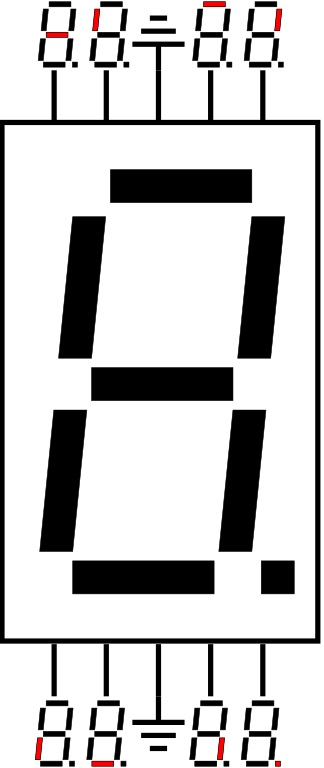
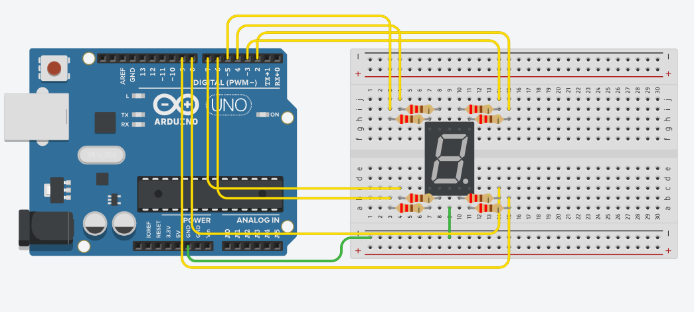
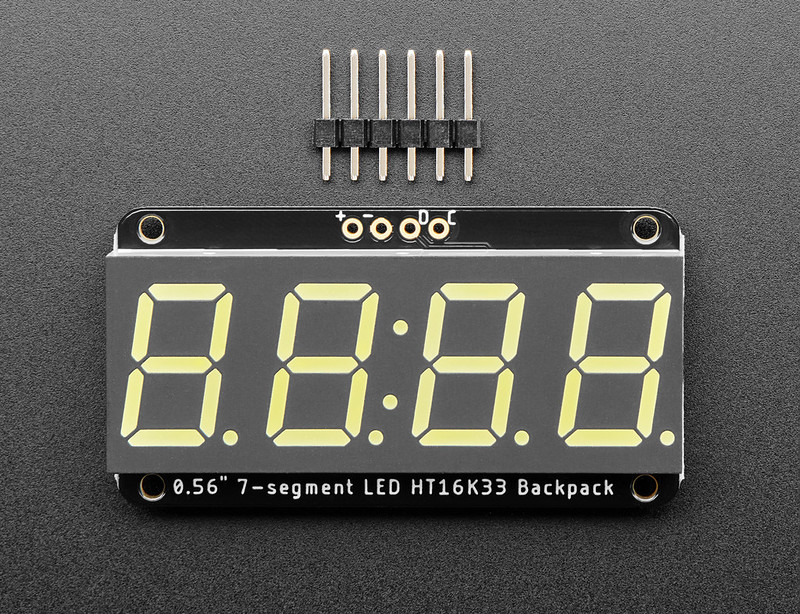
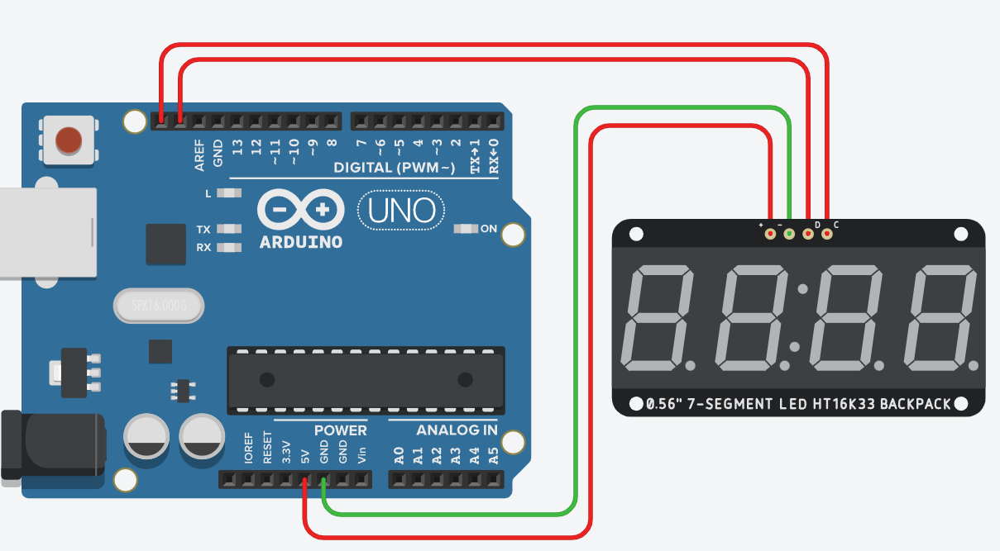

# Segmentidega LED ekraan
Segmentidega LED-ekraanid *(ingl segmented LED displays)* on laialdaselt kasutusel lihtsate numbriliste ja mõnikord ka tähtnumbriliste andmete kuvamiseks. Need ekraanid koosnevad mitmest LED-segmendist, mis süttivad vastavalt sisendsignaalile, moodustades erinevaid sümboleid. Levinumad variandid on 7-segmendilised ekraanid, mida kasutatakse numbrite ja mõne lihtsama tähe kuvamiseks, ning 14- või 16-segmendilised ekraanid, mis võimaldavad esitada ka tähti ja sümboleid. Ekraane saab kasutada eraldiseisvalt ühe numbri kuvamiseks või mitme ühikuna, et luua mitmekohalisi ekraanilahendusi.

Segmentekraanid vajavad mitut ühendusjuhet, kuna iga segment süttib eraldi juhtsignaali mõjul. Lihtsamaid ekraane saab otse ühendada Arduino digitaalsete väljundite külge, kuid mitmekohaliste ekraanide puhul kasutatakse tihti vahepealseid draiverkiipe, nagu [74HC595](https://www.ti.com/lit/ds/symlink/sn74hc595.pdf) nihkeregistrid *(ingl shift registers)* või [MAX7219](https://www.analog.com/media/en/technical-documentation/data-sheets/max7219-max7221.pdf) LED-draiverid, mis vähendavad vajalike ühendusjuhtmete arvu ja lihtsustavad juhtimist. Ekraani juhtimine toimub digitaalsignaalide abil, kusjuures Arduino programm saadab kõrge või madala signaali, et süüdata vastavad segmendid soovitud sümboli kuvamiseks.

Segmentekraanidega lahendused on levinud mitmesugustes rakendustes, sealhulgas digitaalsetes kellades, termomeetrites, loendurites ja väikestes informatsioonipaneelides. Tänu nende lihtsusele, madalale energiatarbele ja heale nähtavusele on need ideaalsed juhtudel, kus on vaja kuvada lihtsaid numbrilisi andmeid. 

## Ühekohaline 7 segmendiga LED ekraan (ühine katood)

*Allikas: https://commons.wikimedia.org/wiki/File:7-Segment_Display_Visual_Pinout_Diagram.svg*

Joonisel on näha kuidas ühendada ühise katoodiga seitsmesegmentdiline LED element Arduino UNO-ga. Iga digitaalne viik kontrollib ühte segmenti.

Kood loendab numbreid 1-5:
~~~cpp
#define a 2
#define b 3
#define c 4
#define d 5
#define e 6
#define f 7
#define g 8
#define h 9

void setup()
{
  pinMode(a, OUTPUT);
  pinMode(b, OUTPUT);
  pinMode(c, OUTPUT);
  pinMode(d, OUTPUT);
  pinMode(e, OUTPUT);
  pinMode(f, OUTPUT);
  pinMode(g, OUTPUT);
  pinMode(h, OUTPUT);
}

void loop()
{
  //1
  digitalWrite(a, HIGH);
  digitalWrite(b, LOW);
  digitalWrite(c, LOW);
  digitalWrite(d, LOW);
  digitalWrite(e, LOW);
  digitalWrite(f, LOW);
  digitalWrite(g, HIGH);
  digitalWrite(h, LOW);
  delay(1000);
   //2
  digitalWrite(a, HIGH);
  digitalWrite(b, HIGH);
  digitalWrite(c, LOW);
  digitalWrite(d, HIGH);
  digitalWrite(e, HIGH);
  digitalWrite(f, HIGH);
  digitalWrite(g, LOW);
  digitalWrite(h, LOW);
  delay(1000);
   //3
  digitalWrite(a, HIGH);
  digitalWrite(b, HIGH);
  digitalWrite(c, LOW);
  digitalWrite(d, HIGH);
  digitalWrite(e, LOW);
  digitalWrite(f, HIGH);
  digitalWrite(g, HIGH);
  digitalWrite(h, LOW);
  delay(1000);
   //4
  digitalWrite(a, HIGH);
  digitalWrite(b, LOW);
  digitalWrite(c, HIGH);
  digitalWrite(d, HIGH);
  digitalWrite(e, LOW);
  digitalWrite(f, LOW);
  digitalWrite(g, HIGH);
  digitalWrite(h, LOW);
  delay(1000);
   //5
  digitalWrite(a, LOW);
  digitalWrite(b, HIGH);
  digitalWrite(c, HIGH);
  digitalWrite(d, HIGH);
  digitalWrite(e, LOW);
  digitalWrite(f, HIGH);
  digitalWrite(g, HIGH);
  digitalWrite(h, LOW);
  delay(1000);
}
~~~

[Interaktiivne simulatsioon](https://www.tinkercad.com/things/91E03JFSJEO-7-segment-led?sharecode=gYLLi06QlWrMUcqER7dSS6QYL_Rao8v4LTf8_T7H8oo)

## Neljakohaline 7 segmendiga LED ekraan (HT16K33 draiveriga)

*Allikas: https://www.flickr.com/photos/adafruit/52391695800/*

Kui on vaja kuvada rohkem sümboleid, siis on kindlasti tarvis kasutada draiverit, sest pole mõeldav iga segmenti juhtida eraldi Arduino viiguga.

Vaatame Adafruit [0.56" 4-Digit 7-Segment Display moodulit](https://www.adafruit.com/product/879)

Seda moodulit kontrollib [HT16K33 driver](https://cdn-shop.adafruit.com/datasheets/ht16K33v110.pdf), mida saame liidestada Arduinoga kasutades [I2C protokolli](https://docs.arduino.cc/learn/communication/wire/). Mooduli kontrollimisel on abiks teek [Adafruit LED Backpack](https://github.com/adafruit/Adafruit_LED_Backpack).

~~~cpp
#include <Adafruit_LEDBackpack.h>
Adafruit_7segment display=Adafruit_7segment();

void setup()
{
  display.begin(0x70);
}

void loop()
{
  //Kirjuta teade NB! 
  //kõiki tähti ei saa kuvada.
  //funktsioon ei ole siin eriti stabiilne
  display.print("tere");
  display.writeDisplay();
  delay(1000);
  
  // Kirjuta kümnendsüsteemi arv
  display.print(1234, DEC);
  display.writeDisplay();
  delay(1000);

  // Kirjuta kuueteistkümnendsüsteemi arv
  display.print(0xBEEF, HEX);
  display.writeDisplay();
  delay(1000);

  // Kirjuta komakohaga arv 
  display.print(3.14);
  display.writeDisplay();
  delay(1000);
}
~~~

[Interaktiivne simulatsioon](https://www.tinkercad.com/things/7JYy3JXhWHI-7-segment-4-kohta?sharecode=2vuKoJUDrNY0UIeD3pLCykF5lLdVt8vS1vDgLXhdqQ0)