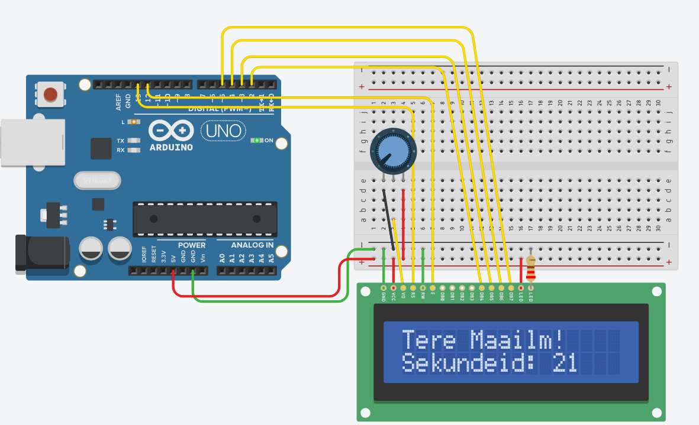
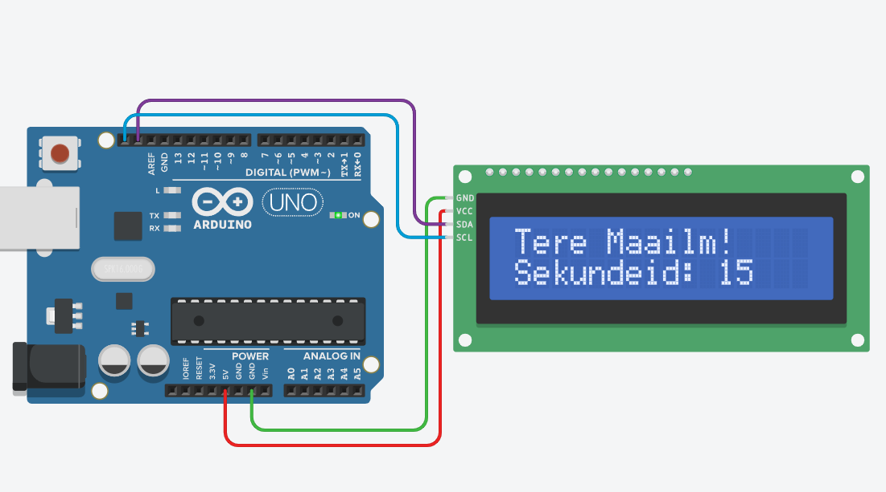

# LCD ekraan

 16x2 märgiga LCD-ekraanid *(ingl 16x2 LCD Display Module)* võimaldavad kuvada teksti või lihtsaid sümboleid, mis teeb neist hea valiku väikesemahuliste andmete (näiteks [andurite](https://github.com/nullyks/Arduino-erinevad-andurid) näitude), teavituste ja menüüde esitamiseks. Kõige sagedamini kasutatakse Hitachi HD44780 kontrolleriga ekraane, mis suhtlevad Arduinoga kas paralleelühenduse või I2C liidese kaudu.

 LCD-ekraani ühendamiseks Arduinoga on kaks peamist meetodit: otsene paralleelühendus (kasutades vähemalt 6 digitaalset viiku) või I2C mooduli abil, mis vähendab vajalike juhtmete arvu. I2C adapter kasutab kahte kanalt – SDA (andmed) ja SCL (takt), mis lihtsustab ühendamist ja vabastab Arduino digitaalsed viigud muude komponentide jaoks.

 Arduino koodis kasutatakse tavaliselt LiquidCrystal või LiquidCrystal_I2C teeki, mis lihtsustab ekraanile teksti kuvamist. Esmalt määratakse ekraaniga seotud viigud ja seejärel saab kasutada funktsioone, nagu lcd.begin(), lcd.setCursor() ja lcd.print(), et teksti soovitud asukohta kuvada. Vajadusel saab ekraanilt ka kustutada lcd.clear() funktsiooniga.

Lisaks tekstile on võimalik ekraanile kuvada ka kohandatud sümboleid, kasutades createChar() funktsiooni. See võimaldab luua graafilisi elemente, näiteks nooli või emotikone. Kohandatud sümboleid saab salvestada ekraani mällu piiratud hulgal, mistõttu tuleb neid kasutada säästlikult.

## 16x2 LCD ekraan paralleelühendusega

Viigud:
* LED_anood - taustavalguse toide
* LED_katood - taustavalguse maandus
* DB0 - andmebit (moodustab käsu või andmed, vastavalt registrile)
* DB1 - andmebit (moodustab käsu või andmed, vastavalt registrile)
* DB2 - andmebit (moodustab käsu või andmed, vastavalt registrile)
* DB3 - andmebit (moodustab käsu või andmed, vastavalt registrile)
* DB4 - andmebit (moodustab käsu või andmed, vastavalt registrile)
* DB5 - andmebit (moodustab käsu või andmed, vastavalt registrile)
* DB6 - andmebit (moodustab käsu või andmed, vastavalt registrile)
* DB7 - andmebit (moodustab käsu või andmed, vastavalt registrile)
* E - ekraani olek. Sees - HIGH; väljas LOW.
* R/W - Lugemis- või kirjutamisrežiimi valik. Enamasti on ekraan kirjutamisreziimis (LOW) aga lugemisrežiimis (HIGH) on võimalik saada informatsiooni ekraani oleku kohta. 
* RS - registri valik (määrab kas andmebitte loetakse kui käsku või andmeid)
* V0 - ekraani heledus (0V-5V)
* VCC - toide (5V)
* GND - maandus

Vaatamata sellele, et seda tüüpi ekraanide andmesisend on 8-bitine oin seda lihtsalt sübolite kuvamiseks võimalik kasutada ka 4-bitises režiimis, mis tähendab, et viike DB0 - DB3 ei kasutata.

~~~cpp
#include <LiquidCrystal.h>
#define rs 13
#define en 12
#define db4 2
#define db5 3
#define db6 4
#define db7 5

LiquidCrystal lcd(rs, en, db4, db5, db6, db7);

void setup() {
  lcd.begin(16, 2); //mitu sümbolit ja rida LCD-l on
  lcd.print("Tere Maailm!"); //prindime teate. Vaikimisi on kursori positsioon 0,0
}

void loop() {
  lcd.setCursor(0, 1); //kursor teise rea algusesse
  lcd.print("Sekundeid: ");
  lcd.print(millis() / 1000); //vaikimisi tagastatakse täisarv.
}
~~~

[Interaktiivne simulatsioon](https://www.tinkercad.com/things/gvI3IEALO53-lcd-paralleel?sharecode=vCY87cJZYWcjj-aNU787N3Cs5Z-ri52MH32JxV27Njg)

## 16x2 LCD ekraan I2C ühendusega (PFC8574 I2C to 8bit I/O adapteriga)

Viigud:
* GND - toite maandus
* VCC - toite 5V
* SDA - I2C andmed
* SCL - I2C takt

Nagu näha on ühendamine oluliselt lihtsam, kogu juhtimine käib I2C liidese kaudu.

~~~cpp
#include <LiquidCrystal_I2C.h>

//aadress, sümboleid, ridu
LiquidCrystal_I2C lcd(0x27,  16, 2);

void setup() {
  lcd.init(); //ekraan sisse
  lcd.backlight(); //taustavalgus sisse
  lcd.print("Tere Maailm!"); //prindime teate. Vaikimisi on kursori positsioon 0,0
}

void loop() {
  lcd.setCursor(0, 1); //kursor teise rea algusesse
  lcd.print("Sekundeid: ");
  lcd.print(millis() / 1000); //vaikimisi tagastatakse täisarv.
  delay(100);
}
~~~

[Interaktiivne simulatsioon](https://www.tinkercad.com/things/5mNyBSpkmbl-lcd-i2c?sharecode=dqEQ3V8nEhG2lbm6JkI8a-kXcxAIlsPoJfBNv0WSC-w)

## Lisamaterjal:
* [Paralleelühendusega LCD täpsemad näited](https://docs.arduino.cc/learn/electronics/lcd-displays/)
* [I2C ühendusega LCD täpsemad näited](https://arduinogetstarted.com/tutorials/arduino-lcd-i2c)