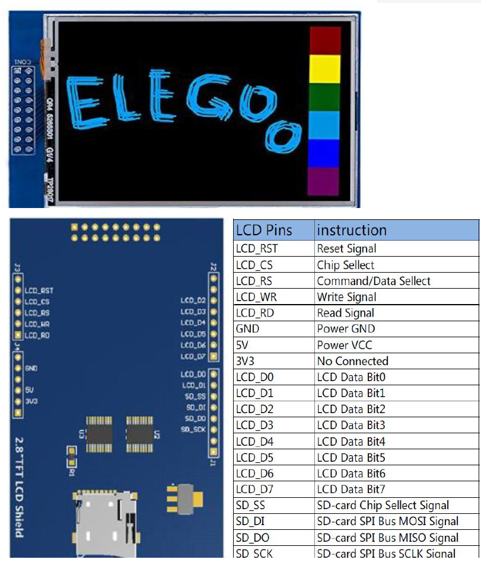
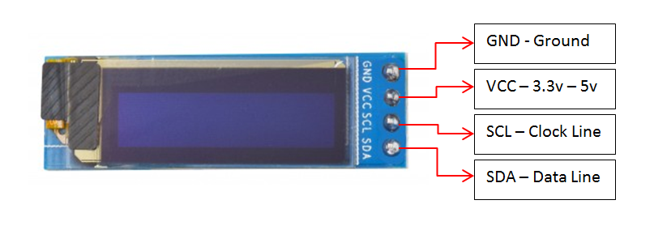

# TFT ja OLED ekraanid

Arduino arendusplaadid võimaldavad suhteliselt lihtsasti suhelda erinevat tüüpi ekraanidega, mis aitavad visualiseerida andmeid ja luua interaktiivseid kasutajaliideseid. Ühed levinumad ekraanid on OLED *(ingl Organic Light Emitting Diode)* ja TFT *(ingl Thin Film Transistor)* puuteekraanid, mis pakuvad head pildikvaliteeti ja laia funktsionaalsust. OLED I2C 0,91-tolline ekraan on väike ja energiasäästlik lahendus, mis kasutab I2C-liidest, samas kui 2,8-tolline TFT puuteekraan toetab mitmevärvilist graafikat ja puutetundlikkust, kasutades SPI-liidest kiireks andmeedastuseks.

Kui OLED-ekraan kasutab I2C-protokolli, mis on aeglasem, kuid võimaldab ühe liidese kaudu ühendada mitmeid seadmeid, siis TFT-ekraan kasutab SPI-protokolli, mis tagab kiirema andmeedastuse, kuid vajab rohkem juhtmeid. I2C-ekraan sobib ideaalselt lihtsamateks projektideks, nagu väikese tekstilise informatsiooni kuvamine, samas kui SPI-põhine TFT-ekraan sobib paremini graafilisteks rakendusteks, näiteks kasutajaliideste ja mängude loomiseks. Õige ekraani valik sõltub seega projekti vajadustest – kui oluline on energiasääst ja lihtne ühendamine, on OLED I2C parem valik, kuid kui oluline on värviline ja kiire graafika, siis on TFT ekraan sobivam.

## 2.8 tolline (240x320 pikslit) puutetundlik TFT ekraan

Suurema eraldusvõime ja mitmevärvilise kuvaga ekraan, mis toetab puutejuhtimist, võimaldades kasutajatel ekraaniga otse suhelda. See ekraan kasutab SPI (Serial Peripheral Interface) protokolli, mis võimaldab kiiret andmeedastust Arduino ja ekraani vahel. Lisaks puutetundlikkusele toetab see ekraan ka SD-kaardi lugemist, mis teeb võimalikuks piltide ja muude andmete salvestamise. Selle ekraani kasutamiseks on vajalik paigaldada tootjapoolsed teegid. Arvestada tuleb, et ekraanimoodul kasutab ära suure osa Arduino UNO viikudest.

Kõik selles ekraani kohta toodud materjalid pärinevad Elegoo 2.8 TFT Touch Screen [kasutaja käsiraamatust](https://download.elegoo.com/03%20Other%20Kits/07%202.8-inch%20Screen/Elegoo%202.8%20Inch%20Touch%20Screen%20User%20Manual%20V1.00.2021.11.19.zip)

Ekraan ühendatakse mooduline otsa Arduino UNO peale.

### Teksti kuvamise näitekood

~~~cpp
#include <Elegoo_GFX.h>    // Core graphics library
#include <Elegoo_TFTLCD.h> // Hardware-specific library
#define LCD_CS A3 // Chip Select goes to Analog 3
#define LCD_CD A2 // Command/Data goes to Analog 2
#define LCD_WR A1 // LCD Write goes to Analog 1
#define LCD_RD A0 // LCD Read goes to Analog 0
#define LCD_RESET A4 // Can alternately just connect to Arduino's reset pin

// Assign human-readable names to some common 16-bit color values:
#define	BLACK   0x0000
#define	BLUE    0x001F
#define	RED     0xF800
#define	GREEN   0x07E0
#define CYAN    0x07FF
#define MAGENTA 0xF81F
#define YELLOW  0xFFE0
#define WHITE   0xFFFF

Elegoo_TFTLCD tft(LCD_CS, LCD_CD, LCD_WR, LCD_RD, LCD_RESET);

void setup(void) {
  Serial.begin(9600);
  Serial.println(F("TFT LCD test"));
  Serial.print("TFT size is "); Serial.print(tft.width()); Serial.print("x"); Serial.println(tft.height());

  tft.reset();

   uint16_t identifier = tft.readID();
   if(identifier == 0x9325) {
    Serial.println(F("Found ILI9325 LCD driver"));
  } else if(identifier == 0x9328) {
    Serial.println(F("Found ILI9328 LCD driver"));
  } else if(identifier == 0x4535) {
    Serial.println(F("Found LGDP4535 LCD driver"));
  }else if(identifier == 0x7575) {
    Serial.println(F("Found HX8347G LCD driver"));
  } else if(identifier == 0x9341) {
    Serial.println(F("Found ILI9341 LCD driver"));
  } else if(identifier == 0x8357) {
    Serial.println(F("Found HX8357D LCD driver"));
  } else if(identifier==0x0101)
  {     
      identifier=0x9341;
       Serial.println(F("Found 0x9341 LCD driver"));
  }
  else if(identifier==0x1111)
  {     
      identifier=0x9328;
       Serial.println(F("Found 0x9328 LCD driver"));
  }
  else {
    Serial.print(F("Unknown LCD driver chip: "));
    Serial.println(identifier, HEX);
    Serial.println(F("If using the Elegoo 2.8\" TFT Arduino shield, the line:"));
    Serial.println(F("  #define USE_Elegoo_SHIELD_PINOUT"));
    Serial.println(F("should appear in the library header (Elegoo_TFT.h)."));
    Serial.println(F("If using the breakout board, it should NOT be #defined!"));
    Serial.println(F("Also if using the breakout, double-check that all wiring"));
    Serial.println(F("matches the tutorial."));
    identifier=0x9328;
  
  }
  tft.begin(identifier);

 
}

void loop(void) {
   tft.fillScreen(BLACK);
  unsigned long start = micros();
  tft.setCursor(0, 0);
  
  tft.setTextColor(RED);  tft.setTextSize(1);
  tft.println("Hello World!");
  tft.println(01234.56789);
  tft.println(0xDEADBEEF, HEX);
  tft.println();
  tft.println();
  tft.setTextColor(GREEN); tft.setTextSize(2);
  tft.println("Hello World!");
  tft.println(01234.56789);
  tft.println(0xDEADBEEF, HEX);
  tft.println();
  tft.println();
  
  tft.setTextColor(BLUE);    tft.setTextSize(3);
  tft.println("Hello World!");
  tft.println(01234.56789);
  tft.println(0xDEADBEEF, HEX);
  
  tft.setTextColor(WHITE);    tft.setTextSize(4);
  tft.println("Hello!");
  tft.setTextColor(YELLOW);    tft.setTextSize(5);
  tft.println("Hello!");
  tft.setTextColor(RED);    tft.setTextSize(6);
  tft.println("Hello!");
  tft.println();
  tft.println();
  delay(1000);delay(1000);delay(1000);delay(1000);delay(1000);
}
~~~

### Graafika kuvamise näitekood

~~~cpp
#include <Elegoo_GFX.h>    // Core graphics library
#include <Elegoo_TFTLCD.h> // Hardware-specific library

#define LCD_CS A3 // Chip Select goes to Analog 3
#define LCD_CD A2 // Command/Data goes to Analog 2
#define LCD_WR A1 // LCD Write goes to Analog 1
#define LCD_RD A0 // LCD Read goes to Analog 0
#define LCD_RESET A4 // Can alternately just connect to Arduino's reset pin

// Assign human-readable names to some common 16-bit color values:
#define  BLACK   0x0000
#define BLUE    0x001F
#define RED     0xF800
#define GREEN   0x07E0
#define CYAN    0x07FF
#define MAGENTA 0xF81F
#define YELLOW  0xFFE0
#define WHITE   0xFFFF

Elegoo_TFTLCD tft(LCD_CS, LCD_CD, LCD_WR, LCD_RD, LCD_RESET);

void setup() {
  Serial.begin(9600);
  tft.reset();
  uint16_t identifier=0x9341;
  tft.begin(identifier);
}

void loop() {
  tft.setRotation(1);
  writeText("Hello World!", BLACK, RED, 4, 20, 0);
  delay(5000);
  tft.drawLine(0, 0,320, 240, GREEN);
  delay(5000);
  tft.drawRect(0,0,100,100, BLUE);
  delay(5000);
  tft.fillRect(0,100,100,100, YELLOW);
  delay(5000);
  tft.drawCircle(160,50,50,RED);
  delay(5000);
  tft.fillCircle(160,150,50, CYAN);
  delay(5000);
  tft.drawTriangle(260,0,210,100,310,100,MAGENTA);
  delay(5000);
  tft.fillTriangle(260,100,210,200,310,200, WHITE);
  delay(5000);
  
}

void writeText(char text[], char bkgcolor[], char txtcolor[], int txtsize, int x, int y){
  tft.fillScreen(bkgcolor);
  tft.setCursor(x, y);
  tft.setTextColor(txtcolor);  
  tft.setTextSize(txtsize);
  tft.println(text);
}

~~~

## 0.91 tolline OLED I2C ekraan

LED-ekraanid kasutavad orgaanilisi valgusdioode, mis ei vaja taustvalgustust, mistõttu on need energiasäästlikud ja selgelt loetavad ka hämaras keskkonnas. 0,91-tolline 128x32 resolutsiooniga OLED-ekraan kasutab I2C kommunikatsiooniprotokolli, mis tähendab, et see vajab ühendamiseks vaid üks juhtmepaar: SDA (andmed) ja SCL (takt). See muudab ekraani ideaalseks väikestes projektides, kus on piiratud arv sisend-/väljundviike. Selle ekraani kasutamiseks tuleb Arduino IDE-sse paigaldada Adafruit SSD1306 ja Adafruit GFX teegid, mis võimaldavad hõlpsalt teksti ja graafikat kuvada.

*Allikas: https://www.instructables.com/Tutorial-to-Interface-OLED-091inch-128x32-With-Ard/*

### Teksti kuvamise näitekood
~~~cpp
#include <SPI.h>
#include <Wire.h>
#include <Adafruit_GFX.h>
#include <Adafruit_SSD1306.h>

#define SCREEN_WIDTH 128 // OLED display width, in pixels
#define SCREEN_HEIGHT 32 // OLED display height, in pixels

#define OLED_RESET     -1 // Reset pin # (or -1 if sharing Arduino reset pin)
#define SCREEN_ADDRESS 0x3C ///< See datasheet for Address; 0x3D for 128x64, 0x3C for 128x32
Adafruit_SSD1306 display(SCREEN_WIDTH, SCREEN_HEIGHT, &Wire, OLED_RESET);

void setup() {
  Serial.begin(9600);

  // SSD1306_SWITCHCAPVCC = generate display voltage from 3.3V internally
  if(!display.begin(SSD1306_SWITCHCAPVCC, SCREEN_ADDRESS)) {
    Serial.println(F("SSD1306 allocation failed"));
    for(;;); // Don't proceed, loop forever
  }
  // Clear the buffer
  display.clearDisplay();
}

void loop(){
  display.setPrintPos(0, 15);
  display.print("0.91 OELD");
  display.setPrintPos(0,30);
  display.print("Tere Maailm!");
  delay(500);
}
~~~

Lisamaterjal:
* [Keerukamad näited OLED ekraaniga](https://arduinogetstarted.com/tutorials/arduino-oled)