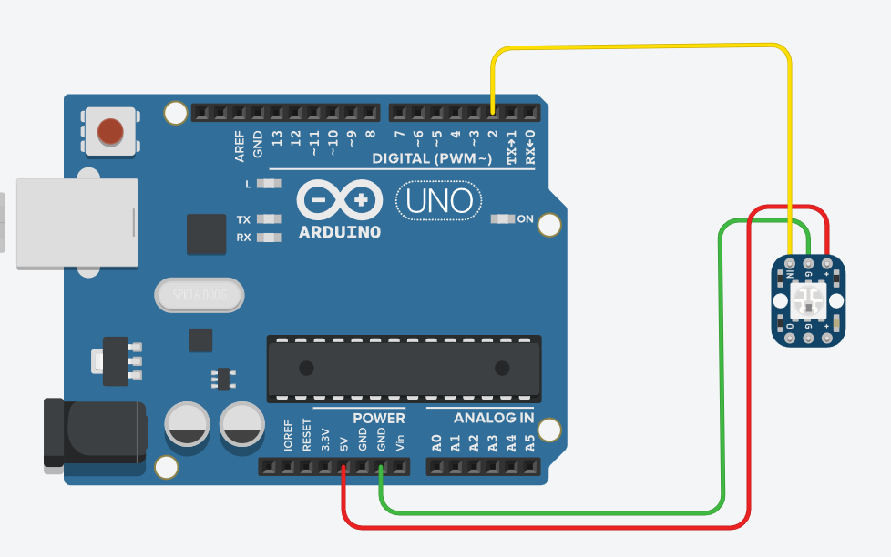
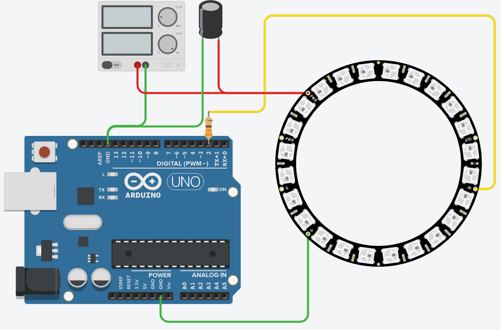

# NeoPixel RGB LED moodulid

NeoPixel LED-id on Adafruit’i välja töötatud programmeeritavad RGB LED-id, mis põhinevad WS2812 või SK6812 kiipidel. Need LED-id ühendavad endas punase, rohelise ja sinise valgusdioodi koos juhtimisahelaga, võimaldades individuaalset värvi- ja heleduskontrolli ühe juhtimissignaali kaudu. Tänu sellele saab neid lihtsasti jadamisi ühendada ja üheainsa andmeviiguga juhtida.

NeoPixel LED-id on väga hästi ühilduvad Arduino arendusplaatidega, kuna nende juhtimine toimub digitaalse signaaliga, mida Arduino suudab hõlpsasti genereerida. NeoPixeleid juhitakse spetsiaalse ajastusega, mistõttu on soovitatav kasutada Adafruit NeoPixel teeki, mis lihtsustab LED-de haldamist. Teek võimaldab hõlpsasti määrata LED-de värve, mustreid ja efekte.

*Allikas: https://www.flickr.com/photos/adafruit/11570878416*

Moodulite toitepinge on tavaliselt 5V, kuid mõned mudelid töötavad ka 3,3V peal. Kuna iga LED tarbib teatud hulga voolu, tuleks suuremate NeoPixel ribade või paneelide puhul arvestada piisava toiteallikaga. Lisatoite kasutamisest [räägime mootorite õppematerjali juures](https://github.com/nullyks/Arduino-mootorid-ja-toide). Samuti on oluline kasutada signaaliliini jaoks ][takistit](https://github.com/nullyks/Arduino-baaselemendid/blob/main/materjalid/1_takistid.md) (tavaliselt 300–500 $\Omega$), et vähendada häireid ning lisada [kondensaator](https://github.com/nullyks/Arduino-baaselemendid/blob/main/materjalid/4_kondensaatorid.md) (umbes 1000 µF) voolu kõikumiste tasandamiseks.

## Ühe NeoPixel LED-i juhtimise näide
NeoPixlite juhtimiseks kasutame Adafruit NeoPixel teeki.
NeoPixlid defineeritakse juhtimiseks massiividena, isegi siis kui massiiv koosneb ühest NeoPixlist. Massiiv initsialiseeritakse, selle igale liikmele määratakse värv ja siis muudetakse massiivi olekut.

~~~cpp
#include <Adafruit_NeoPixel.h>

//neopikslie massiivi juhtviik
#define PIN 2
//neopikslite arv massiivis
#define NUMPIXELS 1

//defineerime massiivi
Adafruit_NeoPixel pixels = Adafruit_NeoPixel(NUMPIXELS, PIN, NEO_GRB + NEO_KHZ800);

int punane = 0;
int roheline = 0;
int sinine = 0;

void setup() {
  pixels.begin(); //initsialiseerime massiivi
}

void loop() {
  juhuslikV2rv(); //leiame juhusliku värvi
  //määrane ainsale neopikslile värvi, mille just leidsime
  pixels.setPixelColor(0, pixels.Color(punane, roheline, sinine));
  //ütleme neopikslite massiivile, et see muudaks oma olekut
  pixels.show();
  //ootame ühe sekundi
  delay(1000);
}

void juhuslikV2rv(){
  punane = random(0, 255); //punasele kanalile juhuslik väärtus
  roheline = random(0,255); //rohelisele kanalile juhuslik väärtus
  sinine = random(0, 255); //sinisele kanalile juhuslik väärtus
}
~~~

[Interaktiivne simulatsioon](https://www.tinkercad.com/things/iXFtzh2B7f1-uks-neopixel?sharecode=hZTGOHoDrqAuIxavLEBTQgAyf7hSm8riAL4VBc4lprE)

## Suurema massiivi juhtimise näide

Kuna suurema massiivi puhul on voolutarve suurem ja seda on vaja stabiliseerida, siis lisame toite ja sellega paralleelselt kondensaatori. Andmesiinile lisame takisti.

~~~cpp
#include <Adafruit_NeoPixel.h>

//neopikslie massiivi juhtviik
#define PIN 2
//neopikslite arv massiivis
#define NUMPIXELS 24

//defineerime massiivi
Adafruit_NeoPixel pixels = Adafruit_NeoPixel(NUMPIXELS, PIN, NEO_GRB + NEO_KHZ800);

int punane=0;
int sinine=0;
int roheline=0;

void setup() {
  pixels.begin(); //initsialiseerime massiivi
}

void loop() {
  for(int i=0; i<=NUMPIXELS; i++){
  	juhuslikV2rv(); //leiame juhusliku värvi
  	//määrane ainsale neopikslile värvi, mille just leidsime
  	pixels.setPixelColor(i, pixels.Color(punane, roheline, sinine));
  	//ütleme neopikslite massiivile, et see muudaks oma olekut
  	pixels.show();
  	//ootame kümnendik sekundit
  	delay(100);
  }
}

void juhuslikV2rv(){
  punane = random(0, 255); //punasele kanalile juhuslik väärtus
  roheline = random(0,255); //rohelisele kanalile juhuslik väärtus
  sinine = random(0, 255); //sinisele kanalile juhuslik väärtus
}
~~~

[Interaktiivne simulatsioon](https://www.tinkercad.com/things/hNjPJxs8AYC-neopikslite-suurem-massiiv?sharecode=Z6iBC-botl81_UovXW-76Bm027HFkab-pVebHodCUUI)